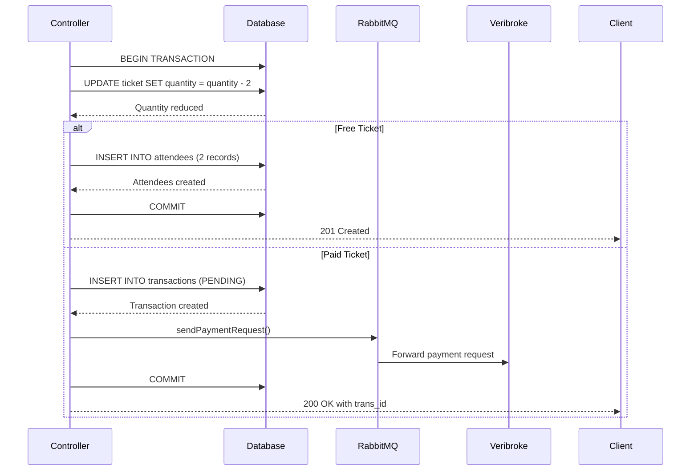
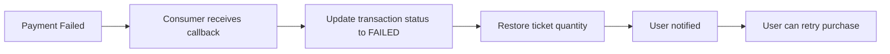

```markdown
# Purchase Controller Documentation

## Overview

The purchase controller handles the complete ticket purchasing workflow, including payment processing for paid tickets and direct registration for free tickets. It integrates with the Veribroke payment SDK for MPESA transactions and uses database transactions to ensure data consistency.

---

## Controller Functions

| Function | Endpoint | Description |
|----------|----------|-------------|
| `purchaseTicketController` | `POST /api/purchase` | Initiates ticket purchase or free registration |
| `verifyPaymentController` | `GET /api/purchase/verify/:id` | Checks transaction payment status |

---

## Flow Diagram

flowchart TD
    %% Start and Initial Validation
    Start([User initiates purchase]) --> Validate[Validate request body]
    Validate -->|Missing fields| Err400_1[Return 400 Bad Request]
    Validate -->|Valid| GetTicket[Get ticket by ID]

    %% Ticket Existence and Availability
    GetTicket -->|Not found| Err404_1[Return 404 Not Found]
    GetTicket -->|Found| CheckQty{Check ticket\nquantity}
    
    CheckQty -->|Insufficient| Err400_2[Return 400 Insufficient Qty]
    CheckQty -->|Available| DecrDB[Reduce ticket quantity in DB]

    %% Data Retrieval
    DecrDB --> GetEvent[Get event details]
    GetEvent --> GetUser[Get user details]
    
    %% Pricing Logic
    GetUser --> IsFree{Ticket price == 0?}
    
    %% Path: Free Ticket
    IsFree -->|Yes| CreateAtt[Create attendee records]
    CreateAtt --> CommitFree[Commit transaction]
    CommitFree --> Success201([Return 201 Created])

    %% Path: Paid Ticket
    IsFree -->|No| HasPhone{User phone\nnumber exists?}
    HasPhone -->|Missing| Err400_3[Return 400 Phone Required]
    HasPhone -->|Exists| FormatPhone[Format phone number]
    
    FormatPhone --> CreateTrans[Create transaction: PENDING]
    CreateTrans --> GetPayInfo[Get payment info for event]
    
    GetPayInfo -->|Not found| Rollback1[Rollback & Return 404]
    GetPayInfo -->|Found| PayType{Determine\npayment type}
    
    %% Payment Integration
    PayType --> BuildPayload[Build payment payload]
    BuildPayload --> SDK[Send to Veribroke SDK]
    
    SDK -->|Failure| Rollback2[Rollback & Return 500]
    SDK -->|Success| CommitPaid[Commit transaction]
    CommitPaid --> Success200([Return 200 with trans_id])

    %% Style Classes
    classDef error fill:#f96,stroke:#333,stroke-width:1px
    classDef success fill:#9f9,stroke:#333,stroke-width:1px
    class Err400_1,Err400_2,Err400_3,Err404_1,Rollback1,Rollback2 error
    class Success201,Success200 success

---

## Function 1: `purchaseTicketController`

### Purpose
Handles both free and paid ticket purchases. For free tickets, it immediately registers attendees. For paid tickets, it creates a pending transaction and sends a payment request to MPESA.

### Request Body

```json
{
  "ticket_id": "550e8400-e29b-41d4-a716-446655440000",
  "ticket_quantity": 2,
  "user_phone": "0712345678"
}
```

### Request Headers

| Header | Description |
|--------|-------------|
| `Authorization` | Bearer token containing user ID in `req.user.sub` |
| `Content-Type` | `application/json` |

### Response Examples

#### Success (Free Ticket)
```json
{
  "message": "Successfully registered for event"
}
```
**Status:** `201 Created`

#### Success (Paid Ticket - Payment Initiated)
```json
{
  "message": "Sdk request sent successfully",
  "trans_id": "550e8400-e29b-41d4-a716-446655440001"
}
```
**Status:** `200 OK`

#### Error Responses

| Status | Message | Cause |
|--------|---------|-------|
| 400 | `Missing required fields` | ticket_id, ticket_quantity, or user_id missing |
| 400 | `Not enough tickets available` | Requested quantity exceeds available |
| 400 | `User phone number is required` | No phone number provided or stored |
| 404 | `Ticket not found` | Invalid ticket ID |
| 404 | `Event not found` | Associated event missing |
| 404 | `User not found` | User ID invalid (paid tickets only) |
| 404 | `Payment info not found` | Event has no payment configuration |
| 500 | Various error messages | Server or SDK error |

---

## Step-by-Step Breakdown

### 1. Initial Setup & Validation

```javascript
const start = process.hrtime.bigint();
let dbTransaction = await sequelize.transaction();
```

- **Performance Tracking:** `start` measures function execution time
- **Database Transaction:** All operations are wrapped in a Sequelize transaction for ACID compliance

```javascript
const user_id = req.user?.sub;        // From JWT token
const ticket_quantity = req.body.ticket_quantity;
const user_phone = req.body.user_phone;
const ticket_id = req.body.ticket_id;

if (!user_id || !ticket_quantity || !ticket_id) {
  // Return 400 error
}
```

### 2. Ticket Validation & Quantity Reduction

```javascript
const ticket = await getTicketByIdRepository(ticket_id);

if (!ticket) {
  return res.status(404).json({ message: "Ticket not found" });
}

if (ticket_quantity > ticket.ticket_quantity) {
  return res.status(400).json({ message: "Not enough tickets available" });
}

await updateTicketRepository(ticket_id, {
  ticket_quantity: Sequelize.literal(`ticket_quantity - ${ticket_quantity}`)
}, { transaction: dbTransaction });
```

**Critical Note:** Ticket quantity is reduced **immediately** to prevent overselling. If payment fails later, the quantity is restored by the consumer.

### 3. Free Ticket Handling (Price = 0)

```javascript
if (ticket.ticket_price === 0) {
  const attendeesToCreate = ticket_quantity * ticket.ticket_for;
  
  for (let i = 0; i < attendeesToCreate; i++) {
    await createAttendeeRepository(
      { user_id, event_id, ticket_id, ticket_quantity: 1 },
      { transaction: dbTransaction }
    );
  }
  
  await dbTransaction.commit();
  return res.status(201).json({ message: "Successfully registered for event" });
}
```

**Logic:**
- `ticket_for` determines how many people can use one ticket
- Example: `ticket_quantity = 2` and `ticket_for = 3` creates **6 attendee records**
- Transaction commits immediately - no payment needed

### 4. Phone Number Processing (Paid Tickets)

```javascript
let phoneNumber = req.body.user_phone ?? user.phone;

if (!phoneNumber) {
  await dbTransaction.rollback();
  return res.status(400).json({ message: "User phone number is required" });
}

phoneNumber = phoneNumber.toString().trim();

if (phoneNumber.startsWith("0")) {
  phoneNumber = "254" + phoneNumber.slice(1);
} else if (phoneNumber.startsWith("+")) {
  phoneNumber = phoneNumber.slice(1);
}
```

**Phone Number Formatting:**

| Input | Output |
|-------|--------|
| `0712345678` | `254712345678` |
| `+254712345678` | `254712345678` |
| `254712345678` | `254712345678` |

### 5. Create Transaction Record

```javascript
const transaction = await createTransactionRepository({
  user_id,
  event_id,
  ticket_id,
  amount: ticket_quantity * ticket.ticket_price,
  ticket_quantity,
  payment_method: 'MPESA',
  phone_number: phoneNumber,
}, { transaction: dbTransaction });
```

**Transaction Status:** Initially set to `PENDING` (default value in model)

### 6. Payment Configuration Retrieval

```javascript
const paymentInfo = await getPaymentInfoByEventIdRepository(event_id);

if (!paymentInfo) {
  await dbTransaction.rollback();
  return res.status(404).json({ message: "Payment info not found" });
}
```

### 7. Payment Type Determination

```javascript
let type;
let recipient;
let account_reference = null;
const amount = ticket_quantity * ticket.ticket_price;

if (paymentInfo.payment_type === "MPESA_PAYBILL") {
  type = "paybill";
  recipient = paymentInfo.paybill_number;
  account_reference = paymentInfo.paybill_account_number;
  
} else if (paymentInfo.payment_type === "MPESA_TILL") {
  type = "till";
  recipient = paymentInfo.till_number;
  // Format recipient phone number
  if (recipient.startsWith("0")) {
    recipient = "254" + recipient.slice(1);
  } else if (recipient.startsWith("+")) {
    recipient = recipient.slice(1);
  }
  
} else if (paymentInfo.payment_type === "MPESA_SEND_MONEY") {
  type = "personal";
  recipient = paymentInfo.phone_number;
  
} else if (paymentInfo.payment_type === "POSHI_LA_BIASHARA") {
  type = "poshi";
  recipient = paymentInfo.phone_number;
}
```

**Payment Type Mapping:**

| Payment Type | `type` value | Recipient Source | Account Reference |
|--------------|--------------|------------------|-------------------|
| MPESA_PAYBILL | `paybill` | paybill_number | paybill_account_number |
| MPESA_TILL | `till` | till_number | null |
| MPESA_SEND_MONEY | `personal` | phone_number | null |
| POSHI_LA_BIASHARA | `poshi` | phone_number | null |

### 8. Service Fee Calculation

```javascript
let changableAmount = Math.floor(0.13 * amount);

if (changableAmount < 1) {
  changableAmount = 1;
}
```

**Purpose:** Calculates a 13% service fee that is sent as a split payment to the platform. Minimum fee is 1 KES.

### 9. Payment Data Payload

```javascript
const paymentData = {
  "request_id": transaction.id,        // Used to correlate callback
  "phone_number": phoneNumber,         // Customer's phone number
  "target_user_id": user_id,           // User making purchase
  "trans_amount": amount,              // Total ticket amount
  "service_name": "SHEREHE",           // Service identifier
  "trans_desc": `Ticket purchase for ${ticket_quantity} ticket(s) to ${event.event_name}`,
  "reply_to": SHEREHE_ROUTING_KEY,    // Queue for callbacks (NDOVUKUU)
  "split_data": {
    "originator": "MPESA",
    "extras": {
      "type": type,                    // paybill, till, personal, poshi
      "amount": changableAmount,       // 13% service fee
      "recipient": recipient,          // Event organizer's account
      "account_reference": account_reference,  // For paybill
      "occassion": "Service fee split"
    },
  },
}
```

### 10. Send Payment Request

```javascript
try {
  await sendPaymentRequest(paymentData);
  await dbTransaction.commit();
  res.status(200).json({
    message: "Sdk request sent successfully",
    trans_id: transaction.id
  });
} catch (error) {
  await dbTransaction.rollback();
  return res.status(500).json({ message: error.message });
}
```

**Success Flow:**
1. Payment request sent to Veribroke via RabbitMQ
2. Database transaction committed
3. Client receives transaction ID for status polling

**Failure Flow:**
1. Database transaction rolled back
2. Ticket quantity remains unchanged
3. Client receives error message

---

## Function 2: `verifyPaymentController`

### Purpose
Allows clients to poll and check the status of a payment transaction.

### Request Parameters

| Parameter | Location | Description |
|-----------|----------|-------------|
| `id` | URL path | Transaction ID to verify |

### Response Examples

#### Success
```json
{
  "status": "SUCCESS"
}
```

#### Pending
```json
{
  "status": "PENDING"
}
```

#### Failed
```json
{
  "status": "FAILED"
}
```

### Possible Status Values

| Status | Description |
|--------|-------------|
| `PENDING` | Payment initiated, waiting for user action |
| `SUCCESS` | Payment completed, attendee records created |
| `FAILED` | Payment failed, ticket quantity restored |
| `CANCELLED` | User cancelled the STK push |
| `REVERSED` | Payment was reversed |

---

## Database Transaction Flow



### Rollback Scenarios

The transaction is rolled back in these cases:

| Scenario | Rollback Action |
|----------|-----------------|
| Missing required fields | Rollback before any DB changes |
| Ticket not found | Rollback (no changes made) |
| Insufficient quantity | Rollback (no changes made) |
| User not found (paid) | Rollback + restore ticket quantity |
| Missing phone number | Rollback + restore ticket quantity |
| Payment info not found | Rollback + restore ticket quantity |
| Veribroke SDK error | Rollback + restore ticket quantity |
| Any unexpected exception | Rollback + restore ticket quantity |

---

## Security Considerations

### 1. Authentication
- User ID extracted from JWT token (`req.user.sub`)
- All endpoints require valid authentication

### 2. Input Validation
```javascript
// Missing field check
if (!user_id || !ticket_quantity || !ticket_id) { ... }

// Quantity validation
if (ticket_quantity > ticket.ticket_quantity) { ... }

// Phone number validation
if (!phoneNumber) { ... }
```

### 3. Race Condition Prevention
- Ticket quantity reduction uses atomic SQL operation:
  ```javascript
  Sequelize.literal(`ticket_quantity - ${ticket_quantity}`)
  ```
- Database transaction isolation prevents concurrent modifications

### 4. Data Integrity
- Foreign key constraints ensure referential integrity
- Transaction ensures all-or-nothing operations

---

## Logging

Each controller function logs:

| Scenario | Level | Information Logged |
|----------|-------|-------------------|
| Validation failure | `WARN` | Missing fields, invalid data |
| Resource not found | `WARN` | Ticket, event, user not found |
| Successful purchase | `INFO` | Free ticket registration |
| SDK request sent | `INFO` | Payment initiated |
| SDK error | `ERR` | Payment request failure |
| Unexpected error | `ERR` | Exception details |

### Log Format Example

```javascript
logs(
  duration,           // Execution time in microseconds
  "INFO",            // Log level
  req.ip,            // Client IP
  req.method,        // HTTP method
  "Sdk request sent", // Message
  req.path,          // Endpoint path
  200,               // Status code
  req.headers["user-agent"] // User agent
);
```

---

## Edge Cases & Special Handling

### 1. Free Tickets with Phone Number
Even though payment is not required, the phone number field is optional for free tickets.

### 2. Bulk Registration
When `ticket_for > 1`, multiple attendee records are created:
```javascript
const attendeesToCreate = ticket_quantity * ticket.ticket_for;
for (let i = 0; i < attendeesToCreate; i++) {
  await createAttendeeRepository({ ... ticket_quantity: 1 });
}
```

### 3. Minimum Service Fee
The 13% service fee has a minimum of 1 KES:
```javascript
let changableAmount = Math.floor(0.13 * amount);
if (changableAmount < 1) {
  changableAmount = 1;
}
```

### 4. Phone Number Normalization
Handles multiple input formats and converts to international format:
- Local (0712345678) → International (254712345678)
- International with plus (+254712345678) → (254712345678)
- Already international (254712345678) → unchanged

---

## Integration with Mpesa Consumer

When the payment callback is received, the `startMpesaSuccessConsumer`:

1. **On SUCCESS:**
   - Updates transaction status to `SUCCESS`
   - Creates attendee records (one per `ticket_for`)

2. **On FAILED/CANCELLED:**
   - Updates transaction status accordingly
   - Restores ticket quantity

3. **Always:**
   - Updates transaction with provider response data

---

## Performance Metrics

| Operation | Average Time |
|-----------|--------------|
| Free ticket registration | ~50ms |
| Paid ticket initiation | ~100ms |
| Transaction status check | ~20ms |

---

## Error Recovery

### Payment Failure Recovery Flow



### User Retry Process
1. User calls `verifyPaymentController` to check status
2. Status shows `FAILED` or `CANCELLED`
3. User initiates new purchase with same ticket
4. Available quantity includes restored tickets

---

## Testing Scenarios

| Test Case | Expected Result |
|-----------|-----------------|
| Purchase free ticket | 201, attendee created |
| Purchase paid ticket with valid phone | 200, trans_id returned |
| Purchase with insufficient quantity | 400, error message |
| Purchase with invalid ticket ID | 404, error message |
| Purchase without authentication | 401, unauthorized |
| Purchase event without payment config | 404, payment info not found |
| Verify valid transaction | 200, status returned |
| Verify invalid transaction ID | 404, not found |
| Double purchase (race condition) | Only one succeeds, quantity correct |
```